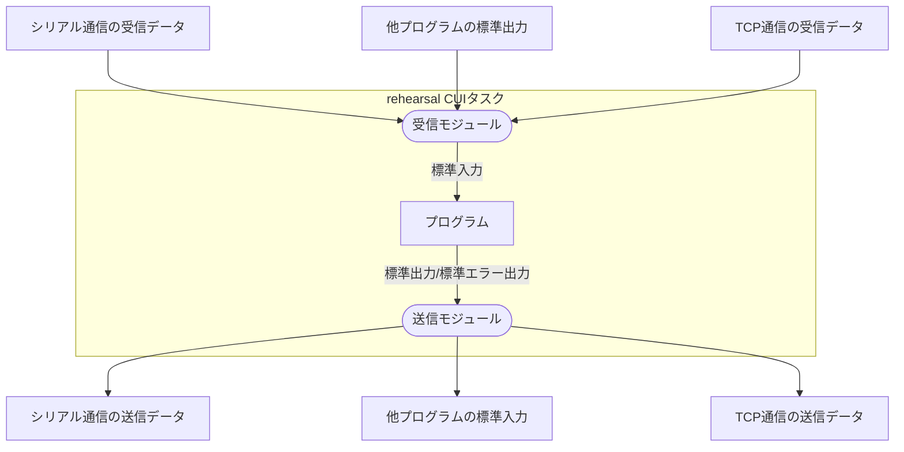

## rehearsalとは？{#what_is_rehearsal}

[「rehearsalについて（about）」](/about/#about)でも述べたように、rehearsalは自らの定義を「プロセスリレーションツール」と位置づけています。具体的には、各プロセス間の入出力を監視し、「任意の形式」に変換したうえで出力をほかのプロセスの入力として与えます。任意の形式には標準入出力、シリアル通信、TCP通信などが含まれており、rehearsalは内部で相互変換を行い、任意のプロセスに入力データとして与えます。

以下は標準入出力を使用するプログラムを用いた場合のイメージ図です。

ここでひとつ重要なことがあります。 **上に示されている「rehearsal CUIタスク」の外部にあるデータはすべて他のタスクによって管理されているということです。** シリアル通信の受信データもそれを実際にシリアル通信から受信ためのタスクがあり、他プログラムの標準出力もそれを受け取るためのタスクが存在します。

タスクは内部で実行しているプロセスを監視するだけでなく、他プロセスへ出力を送信、そのデータを入力データとして内部で実行しているプロセスに送信する働きを担っているのです。
