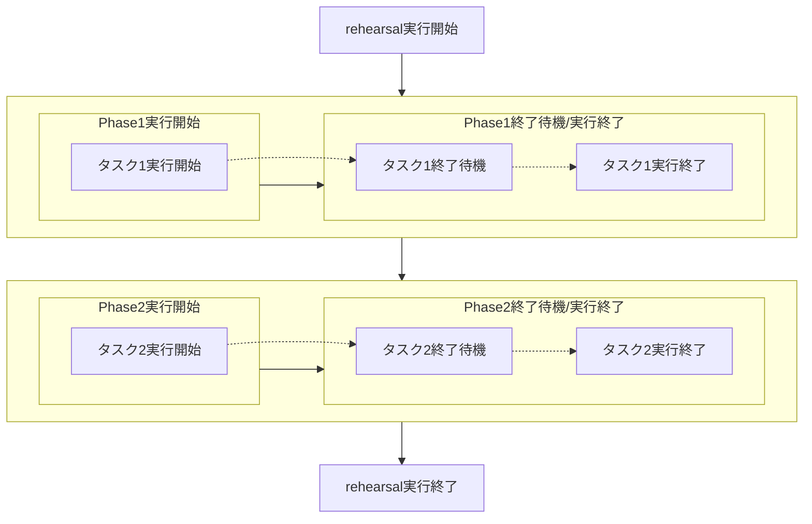
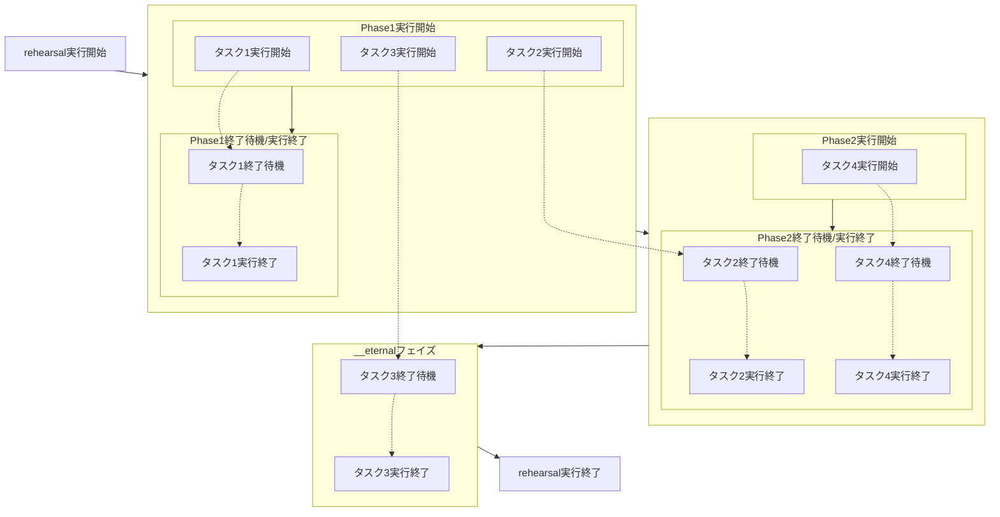

## タスク間の依存関係

[プロセスとタスク](/documents/task-concepts/process-and-task)でも解説した通り、rehearsalのタスクは並列的に実行されます。これは各タスクの入出力をリアルタイムに同期させる意味では理想的な状態です。しかし、現実では以下のような不都合を生じることがあります。

- 他のタスクに依存する場合
    - これには、アプリケーションのビルドをタスクに含める場合などが含まれます。
- 一度にデータを送信したい場合
    - rehearsalのように非同期の仕組みを持たないレガシーなプロダクトを使用する場合などが含まれます。

rehearsalではそのようなニーズに対応するため、フェイズという概念を導入することで、排他的なタスクの実行を行うことができます。

といっても、フェイズは口にするほど難しい概念ではありません。同一フェイズに含まれるタスクを並列的に実行し、そのフェイズ内のタスクが終了するまで他のフェイズ内に含まれてるタスクの実行を待機する仕組みです。

以下の例を見てください。以下の例では`phase1`と`phase2`という名前のフェイズをそれぞれ定義し、その中でそれぞれに`task`という名前のタスクを定義しています。
```yaml
version: 1.202109
phase:
- name: phase1
  task:
  - name: task # (1)
  　wait: true
- name: phase2
  task:
  - name: task # (2)
    wait: true
``` 

`(1)`と`(2)`は同一名ですがrehearsal内部では別名として定義され、それぞれ`phase1::task`と`phase2::task`として定義されます。これらの命名は`sendto`プロパティで送信先のタスクを指定する際に使用できます。

この例では以下のような実行フローとなります。



## フェイズ間の越境とタスク
前のセクションではタスクの実行を分割する方法について説明しました。しかし、現実では複数のフェイズ間で単一のタスクを実行したい場合があります。そういった場合に`until`プロパティは有用です。

このプロパティは別のフェイズで終了待機または実行終了を行うことを指定します。指定しなかった場合は実行したフェイズで終了待機または実行終了を行います。

```yaml
version: 1.202109
phase:
- name: phase1
  task:
  - name: task1 # (1)
  　wait: true
  - name: task2 # (2)
    wait: true
    until: phase2
  - name: task3 # (3)
    wait: true
    until: __eternal
- name: phase2
  task:
  - name: task4 # (4)
    wait: true
``` 



`(1)`のタスクは前のセクションと同じ、同一のフェイズ内で実行および終了待機を行っています。それに比べて`(2)`のタスクは`Phase1`フェイズで実行開始した後、`until`プロパティで指定した`Phase2`フェイズにて終了待機を行います。

`(3)`のタスクの`until`プロパティには`__eternal`が定義されています。これは一番最後に終了するタスクを定義するためのシステム内で定義されるフェイズです。これはユーザーの定義したすべてのフェイズが終了した後に実行されることが保証されます。
