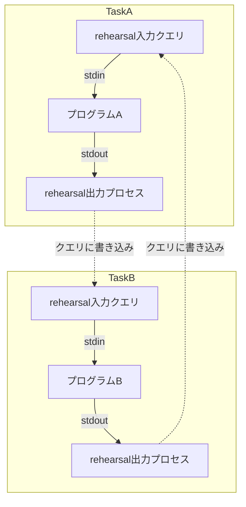
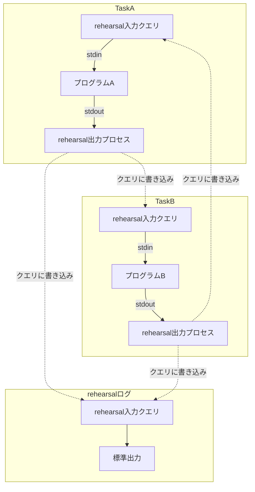

# タスク間の処理

rehearsalでは、TCP通信を行うプロセスや内部でアプリケーションを実行するプロセスをそれぞれ一個のタスクとして管理することを前の章で確認しました。しかし、rehearsalはその仕組み上、単一のタスクを回すだけではその真価を発揮することはありません。そこで、この段では複数のタスクがどのようにして組み合わさるのかを解説します。

そもそも、rehearsalは個々のタスクを監視し、その入出力を渡す事にしかその焦点を当てていません。この事から以下のような性質があります。
- rehearsalのタスクには依存関係がありません。
- rehearsalのタスクは並列的に実行されます。

## 例：循環接続

以下の例を見てください。以下の例では`TaskA`と`TaskB`がお互いの標準出力を相手の標準入力に送信しています。
```yaml
version: 1.202109
phase:
- name: "example"
  task:
  - name: TaskA
    stdout:
      sendto: TaskB
  - name: TaskB
    stdout:
      sendto: TaskA    
```

この場合、以下のように連携を**非同期に**行います。

この例のような循環接続は対話型のアルゴリズムの動作テストを行うのに非常に有用です。このような事例のために、rehearsalは依存関係を制限する構文に対して非常に消極的です。

## システムタスク
ところで、rehearsal自身が各タスクの出力をログとして出力する際にもこのタスクは使用されています。上の例に書き足してみましょう。
```yaml
version: 1.202109
phase:
- name: "example"
  task:
  - name: TaskA
    stdout:
      sendto: TaskB
      write-log: true
  - name: TaskB
    stdout:
      sendto: TaskA
      write-log: true
```

この場合、rehearsalは内部にログ生成用のタスクを用意し、その標準入力に各タスクの標準出力を接続するので以下のようなプロセスを組むことになります。


rehearsalのログはそれ自身もまたrehearsalの一個のタスクとして管理されているのです。しかし、rehearsalのログはその仕組み上、メモリを多く消費することがあるので使用は推奨できません。
